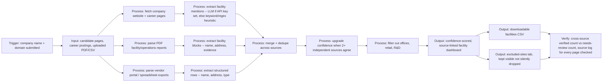

# Proposal - Scraping, Data Extraction, Automation Expert

**Job URL:** https://www.upwork.com/jobs/Scraping-Data-Extraction-Automation-Expert_~022086629386041695605/
**Live demo:** https://facility-finder-demo-uvykgy2t3zs7tevjyuabyz.streamlit.app/
**Repo:** https://github.com/PureGit90/facility-finder-demo

---

## 1. Demo Link (line 1)

**Live demo: https://facility-finder-demo-uvykgy2t3zs7tevjyuabyz.streamlit.app/**
Built a working version of the exact system you described: give it a company name and domain, get back a confidence-scored list of manufacturing plants, warehouses, distribution centers, and fulfillment centers, with source links and evidence for every result.

## 2. Hook

I built a company-agnostic facility finder, not a scraper tuned to one company, that pulls from the same source types your post lists: website location pages, career postings, PDF reports, and vendor/spreadsheet exports, then merges and confidence-scores what it finds.

## 3. Demo Reference

- Takes a company name + domain, checks likely location/career pages, and runs real PDF and spreadsheet parsing against uploaded documents
- Merges results across sources and auto-upgrades confidence when two independent sources agree on the same facility (in the sample run, 4 of 6 facilities get cross-confirmed this way)
- Flags single-source, low-authority mentions as "needs review" instead of presenting them as fact, matching your accuracy-over-completeness requirement
- Filters out offices, retail, and R&D sites automatically, but keeps them visible in a separate tab with the reason, so nothing gets silently dropped
- Every result carries its source URL and an evidence quote, and the run stops after a defined number of sources rather than crawling indefinitely
- Screenshots attached: main facility dashboard + excluded-sites tab

## 4. Architecture

**Trigger:** Company name + domain submitted (or a PDF/spreadsheet uploaded directly)
**Input:** Candidate website pages, career postings, uploaded PDF facility reports, vendor portal spreadsheet exports
**Processing:** Fetch and extract text from each source, classify facility mentions (LLM-based when a Claude key is set, keyword/regex heuristic otherwise), merge and dedupe across sources, upgrade confidence on cross-source matches, filter non-operational sites
**Output:** Confidence-scored, source-linked facility list plus a downloadable CSV
**Verification:** Source log shows exactly what was checked and what turned up nothing; cross-source-verified count vs. needs-review count gives an at-a-glance accuracy signal

## 5. Tech Stack & Timeline

**Stack:** Python, requests + BeautifulSoup for site crawling, pdfplumber for PDF extraction, pandas for spreadsheet/vendor data, Claude API for classification and extraction, Playwright for JS-rendered pages and interactive maps in production
**Timeline:** Given this is ongoing, 30+ hrs/week work, I'd start with a focused first week: point the pipeline at 3-5 of your actual target companies, tune the extraction against real results, and get the confidence/review logic calibrated to what you consider a false positive
**What you get from week one:**
- The pipeline running against real companies you name, not sample data
- A working confidence and review-status system tuned to your accuracy bar
- Documentation of what source types it handles and how to add new ones without per-company code

## 6. Pricing

**Rate: $17/hr**, inside your posted $10-20/hr range, weighted toward the upper half because the core system (multi-source extraction, dedup, confidence scoring) is already built and proven in the demo, not a from-scratch build.

**How I'd structure the first week:** run the pipeline against a handful of your actual target companies, log where it gets facilities right, where it misses, and where the confidence scoring needs tuning against your own judgment calls. That gives us a real accuracy baseline before scaling to your full company list.

**Phase 2 (once accuracy is dialed in on real companies):**
- JS-rendering layer (Playwright) for sites the current requests-based crawler can't reach
- Interactive map / embedded API extraction for companies that only publish locations that way
- Batch mode for running the full company list on a schedule, with a review queue for anything flagged needs-review

---

## Notes for Marco (Gate 2)

- Client: Jakarta-based, Health & Fitness small company (2-9 people), member since Nov 2024, $2.1K total spent, 26 hires / 3 active, 131 hours logged with freelancers. Established hirer, not a first-timer.
- Job stats: 20-50 proposals, 17 interviewing, 30 invites sent (3 unanswered), last viewed applicants 2 days ago. This is a live, actively-managed search, not a stale post.
- Contract-to-hire, More than 30 hrs/week, 1-3 months, Expert level. This could become a longer relationship if the first few weeks land well.
- Client explicitly asked applicants to describe their approach to the company-agnostic design, verification/false-positive handling, and tech stack in the cover letter, not just show a demo. The Upwork message below is written to hit those points directly since the client is clearly reading proposals closely (17 interviewing already).
- Bid at $17/hr per the no-reviews rate strategy (client range $10-20/hr, bid at/slightly above midpoint).
- Demo repo pushed standalone per repo-isolation policy; Streamlit Cloud deploy and screenshot capture still need to happen before this goes out (handled separately, not by this build task).
