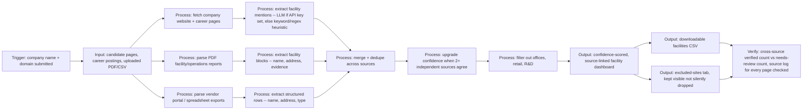

# Workflow -- Facility Finder

## What the pipeline catches in the sample data

1. **Cross-source confirmation** -- "Columbus Injection Molding Plant" and "Phoenix Regional
   Distribution Center" both appear on the company's own `/locations` page *and* in the vendor
   portal export, so the pipeline automatically upgrades them to `High` confidence and
   `Verified (cross-source match)`.
2. **Confidence upgrade on merge** -- "Dayton Manufacturing Plant No. 2" starts as a `Medium`
   confidence single mention from a career page job posting, then gets confirmed by the annual
   report PDF and is upgraded to `High`, `Verified (cross-source match)`.
3. **Needs-review flagging** -- "Atlanta Cross-Dock Facility" only appears once, in a vague
   career-page mention with no street address, so it stays `Low` confidence and `Needs Review`
   instead of being presented as a fact.
4. **Exclusion, not deletion** -- "Corporate Headquarters" (from the website) and "Corporate
   Showroom (Chicago)" (from the PDF) are both correctly classified as `Office` and filtered
   out of the main facility list, but stay visible in the Excluded tab with the source that
   flagged them.

## Source types this pipeline handles today

| Source type | How it's read |
|---|---|
| Company website pages | `requests` + BeautifulSoup text extraction, keyword or LLM classification |
| Career page postings | Same fetch path, tagged as a lower-authority source type |
| PDF reports | `pdfplumber` text extraction + regex block parsing (name / address / evidence) |
| Vendor portal / spreadsheet exports | `pandas` structured row parsing |

Adding a new source type (e.g. an interactive map's underlying JSON API) means adding one new
loader function that returns the same record shape -- the merge, dedupe, confidence, and
exclusion logic downstream doesn't change per company or per source.
